## Technical Requirements
- Build a full-stack application by making your own backend and your own front-end
- Use an Express API to serve your data from a Mongo database
- Consume your API with a separate front-end built with React
- Be a complete product which most likely means multiple relationships and CRUD functionality for at least a couple of models
- Implement thoughtful user stories/wireframes that are significant enough to help you know which features are core MVP and which you can cut
- Have a visually impressive design to kick your portfolio up a notch and have something to wow future clients & employers. ALLOW time for this.
- Be deployed online so it's publicly accessible.
- Have automated tests for at least one RESTful resource on the back-end, and at least one classical and one functional component on the front-end. Improve your employability by demonstrating a good understanding of testing principals.

## Technologies Used
- HTML5
- CSS3
- JavaScript
- Bulma CSS Framework
- React.js
- Node.js
- Express.js
- React-reveal
- FileStack.js
- Postcodes.io
- Leaflet
- MongoDB
- GitHub
- Git

## Overview
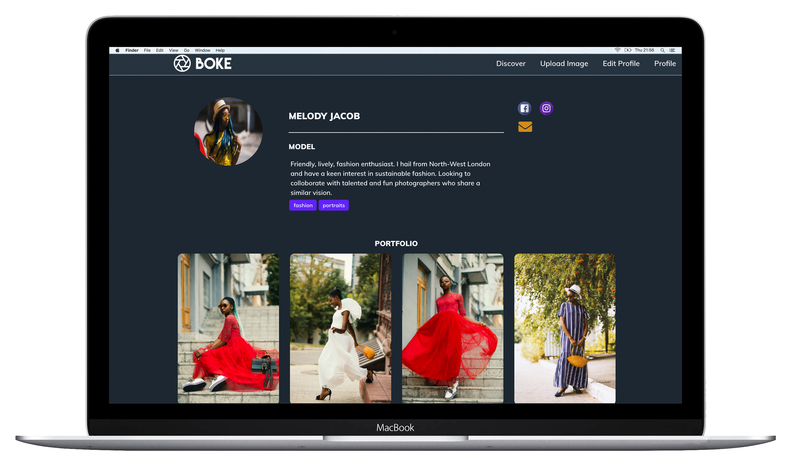

Photography has become my favourite hobby over the past year. One of the challenges I personally faced was finding models to shoot portraits with. During the research phase of this project, I found that apps such as Instagram has a vast number of users but had limited functionality to filter through interests and location easily and quickly.

'Boke' is a MERN full stack web-application which serves as a collaborative platform for aspiring photographers and models to connect through location filters, upload images, like and comment on each other's portfolios.

The application is mobile, tablet and desktop friendly.

## Approach Taken
As this was my final project for the General Assembly Web Development Immersive Programme, I wanted to utilise my experience from previous projects and run this project as smooth as possible. More focus was placed on planning and styling, as I did not want to leave styling till the last day. This approach proved to be the most efficient for this project.

I created a Trello board with thorough user stories and reviewed/updated them throughout the day -

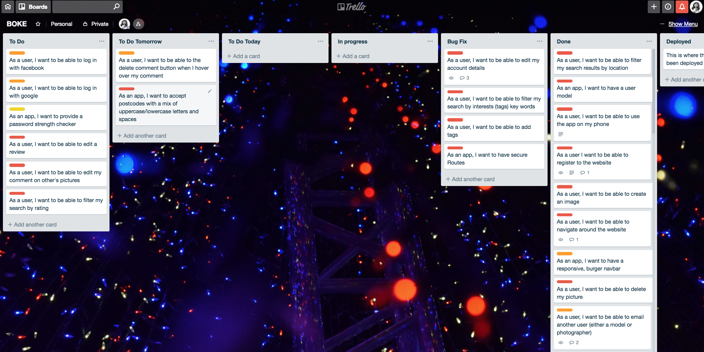

The MVP of the application was to add the following features:
- Allow users to register and login securely

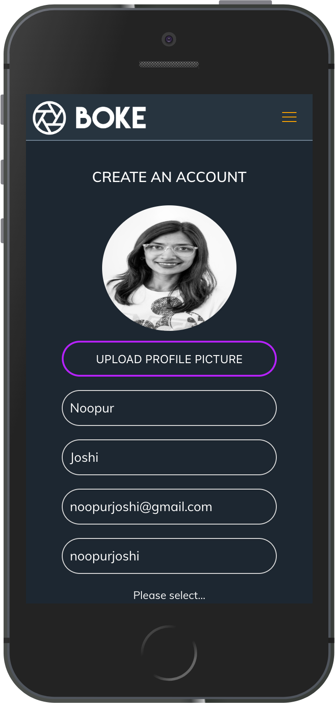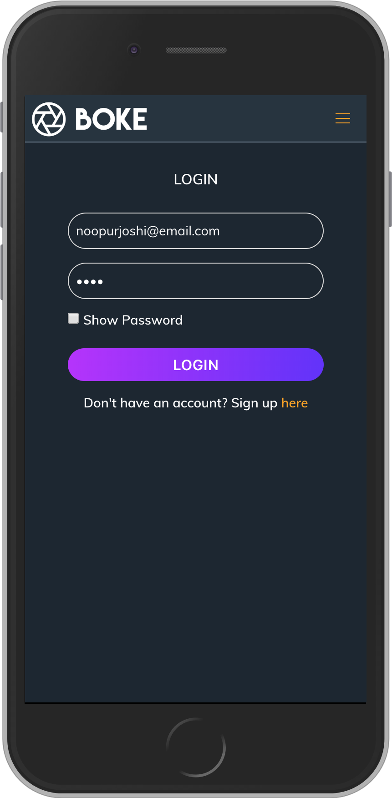

- Allow users to comment on images

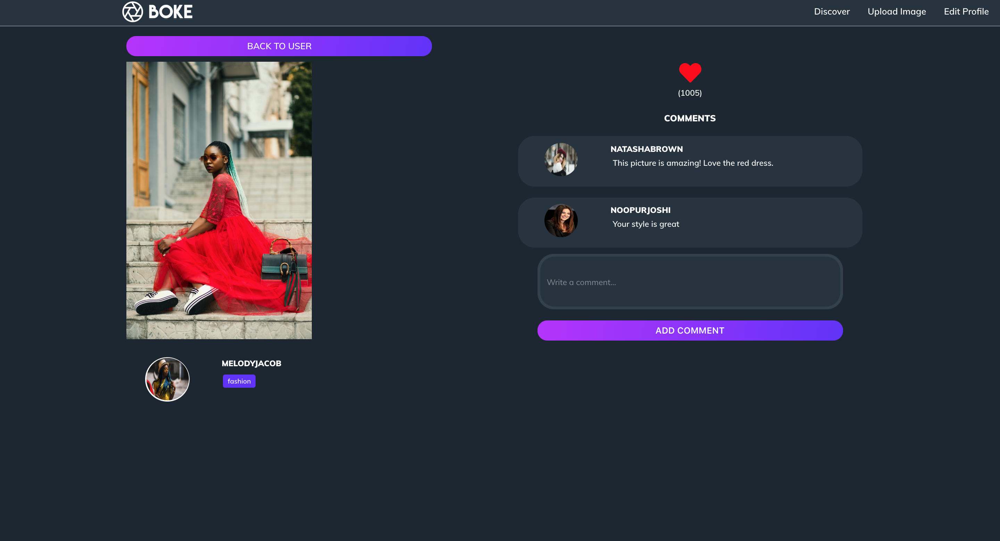

- Allow users to add and delete reviews on user profiles

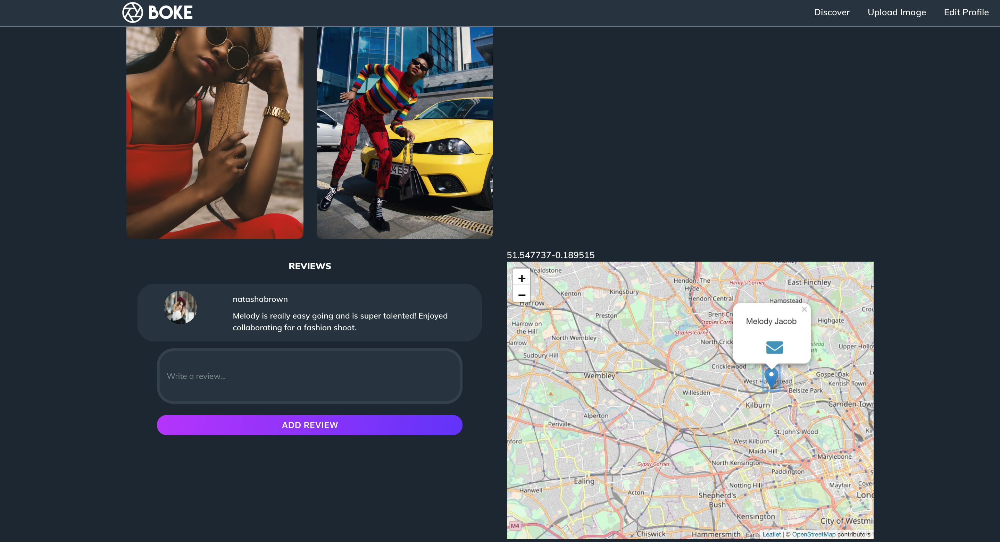

- Allow users to edit or delete their user profile

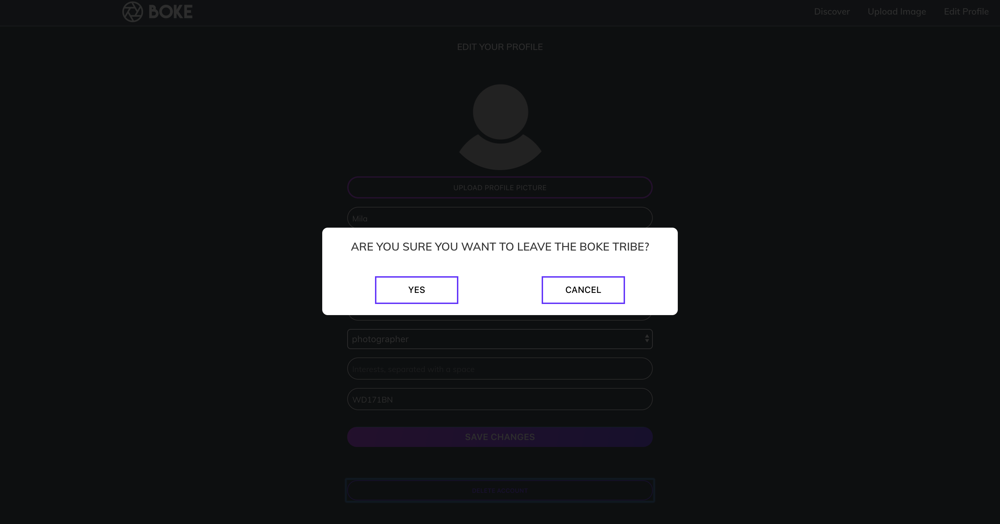

- Allow users to search and see other users profile
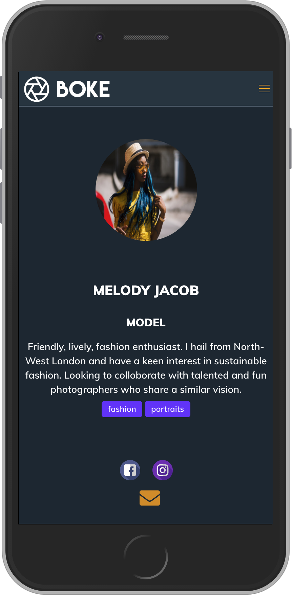

- Allow user to upload an image

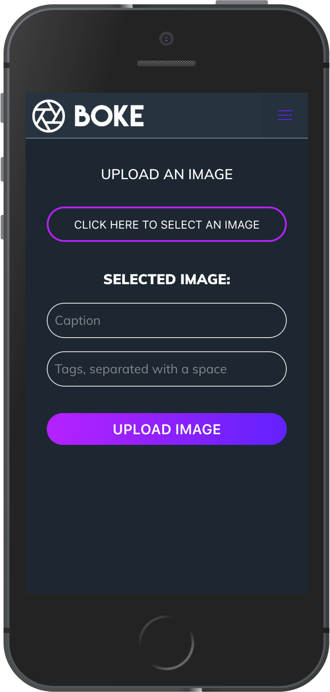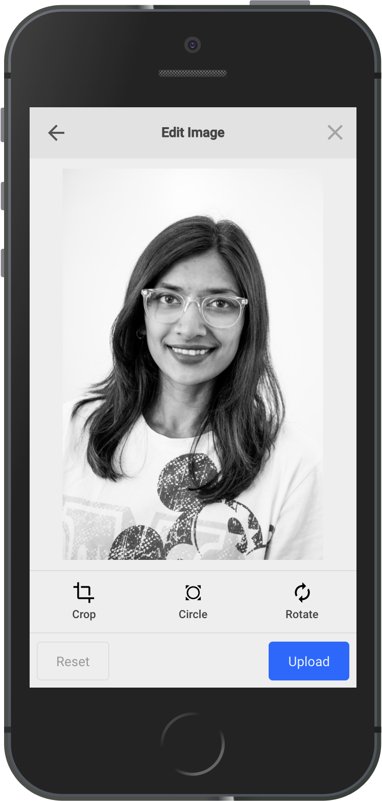

- Allow users to filter by type (model or photographer) and distance

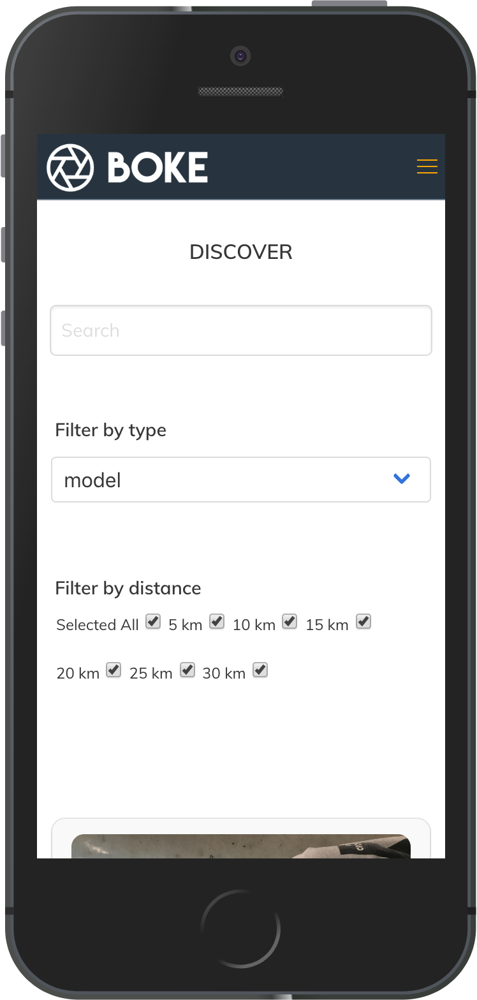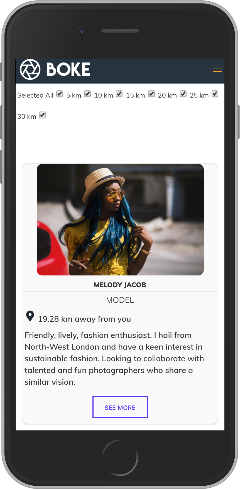

## Wins
- A big win for me was to calculate the distance between the current logged in user's location and all the other users location, then sort the nearest users first when the page loads. I achieved this without using an external API such as MapQuest.
- Another win was to be able to hit my daily targets on my Trello board. Overall this project was the least stressful out of the four projects and I was pleased with the outcome of the features, styling and responsiveness of the application.

## Challenges
- A challenge I faced was asynchronous nature of React when calculating the distance between user locations. I had to refactor my code to ensure user information was first retrieved from the database and then the calculations took place.

## Bonus Features
- Use react-reveal npm module for styling
- Integrate FileStack for image upload
- Use Leaflet map to display user location on the profile page

## Future Features
- React gives the power to break down each component, I'd like to refactor my code to further break down my forms and other components which are used on multiple pages.
- Allow users to send and accept friend requests
- Allow users to message each other via a chatbot or some sort of inbox system
- Fix bugs - if the user decides not to share their location, the list of users on the 'Discover' page do not load properly
- Currently the logout button is hidden when using the application on a browser, I'd like to fix this bug
